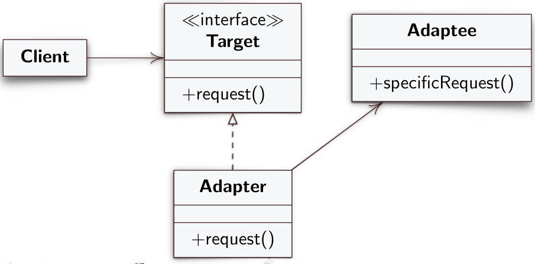
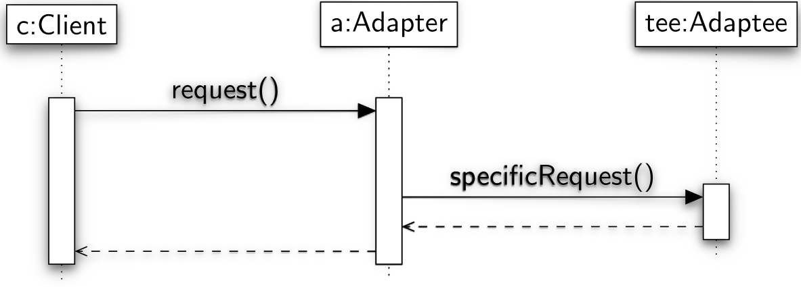

# Adapter
L'adapter è un design pattern strutturale che permette di far lavorare insieme due interfacce incompatibili.
## Intento
L'adapter permette di convertire l'interfaccia di una classe in un'interfaccia diversa che i client si aspettano di utilizzare.
## Problema
Capita spesso le API usate in un'applicazione vengono aggiornate cambiando ad esempio nome dei metodi, tipo e numero dei parametri che i metodi prendono in input ecc. Le classi scritte che fanno utilizzo delle API non funzionerebbero più perché richiamerebbero metodi che non esistono più o che hanno signature diversa. Riscrivere le classi client non è sensato perché richiederebbe una nuova progettazione, una nuova fase di test (c'è il rischio di introdurre nuovi errori) e, in generale, troppo tempo.
## Soluzione
I ruoli che il design pattern **Object Adapter** stabilisce per risolvere il problema sono:
- **Target**: l'interfaccia che il client si aspetta di utilizzare
- **Client**: invoca metodi messi a disposizione dal *Target*
- **Adaptee**: libreria che deve essere adatatta alle chiamate dei *Client*
- **Adapter**: implementa l'interfaccia *Target*. All'interno di ogni metodo dell'interfaccia *Target* implementato farà una chiamata ad un metodo della classe di libreria *Adaptee*. L'*Adapter*, quindi, fa una mappatura dei metodi che lui stesso implementa e che i *Client* conoscono in metodi della classe di libreria *Adaptee*. La mappatura dei metodi può consistere nell'adattamento dei nomi dei metodi chiamati dal client in nomi di metodi della libreria, nell'adattamento del tipo o del numero di parametri che il metodo di libreria si aspetta di ricevere ecc.

---
## Diagramma UML delle classi


---
## Diagramma UML di sequenza


---
## Esempio
```java
// Target
public interface ILabel {
	public String getNextLabel();
}
```

```java
// Adapter
public class Label implements ILabel {
	private LabelServer ls;
	private String p;
	public Label(String prefix) {
		p = prefix;
	}
	public String getNextLabel() {
		if (ls == null)
			ls = new LabelServer(p);
		return ls.serveNextLabel();
	}
}
```

```java
public class LabelServer { // Adaptee
	private int labelNum = 1;
	private String labelPrefix;
	public LabelServer(String prefix) {
		labelPrefix = prefix;
	}
	public String serveNextLabel() {
		return labelPrefix + labelNum++;
	}
}
```

```java
public class Client {
	public static void main(String args[]) {
		ILabel s = new Label("LAB");
		String l = s.getNextLabel();
		if (l.equals("LAB1"))
			System.out.println("Test 1:Passed");
		else
			System.out.println("Test1:Failed");
	}
}
```

## Varianti
### Class Adapter
Una variante dell'Object Adapter è il **Class Adapter** in cui la classe che svolge il ruolo di *Adapter* è sottoclasse della classe che svolge il ruolo di *Adaptee*. Implementando *Adapter* come sottoclasse di *Adaptee* facciamo 'si che la prima erediti tutti i metodi della seconda, in questo modo c'è più controllo su quali chiamate bisogna effettuare la "traduzione". I metodi per cui non serve fare mappatura verranno richiamati, attraverso l'*Adapter* che li eredita direttamente dalla classe *Adaptee*.

```java
// Adapter
public class Label extends LabelServer implements ILabel { 
	public Label(String prefix) {
		super(prefix);
	}
	public String getNextLabel() {
		return serveNextLabel(); // adapter invoca il metodo su se stesso richiamando, di fatto la superclasse
	}
}
```
### Adapter a due vie
È una variante in cui la classe che svolge il ruolo di *Adapter* offre sia l'interfaccia che il client si aspetta (definita normalmente nel *Target*) che le classi della libreria. In questo modo si cerca di facilitare l'implementazione dei client fornendo un solo punto di accesso ai metodi della libreria. Il *Class Adapter* è un **Adapter a due vie**.

## Conseguenze
I vari client e le classi di libreria rappresentate da *Adaptee* possono interagire ognuno in modo indipendente tramite la classe *Adapter* senza modificare client ne libreria. Il design pattern adapter facilita la progettazione di componenti che implementano controlli aggiuntivi come **precondizioni** e **postcondizioni**. 

Una precondizione è una condizione che deve essere neecssariamente soddisfatta prima che si invochi il metodo se si vuole avere una corretta esecuzione del metodo stesso. Le precondizioni nascono dalla considerazione che quando si esegue un frammento di codice come un metodo, questo lavora facendo certe assunzioni preventive ad esempio se il metodo lavora con le stringhe potrebbe assumere di lavorare con delle stringhe non vuote. Per garantire una corretta esecuzione del metodo, quindi, bisgona valutare le condizioni che soddisfano le assunzioni che il metodo fa per terminare senza errore la propria esecuzione. Possiamo implementare verifiche di precondizioni all'interno della classe *Adapter* prima che l'esecuzione passi ai metodi di libreria.

Una postcondizione è una condizione che sarà sicuramente verificata se il frammento di codice ha terminato la propria esecuzione senza alcun errore. Anche in questo caso possiamo implementare delle verifiche delle postcondizioni dopo la chiamata ai metodi della libreria all'interno della classe *Adapter*.

L'Object Adapter può implementare **laziy initialisation**. Questa tecnica permette di rimandare la creazione di istanze di una classe solamente al momento in cui l'istanza viene effettivamente richiesta da una classe client. Nel nostro caso si aspetta che una classe client invochi un metodo della classe *Adaptee* (libreria) prima di istanziarla. Questo permette di migliorare le prestazioni a runtime sopratutto nel caso di istanziazione di grosse classi che consumano tempo computazionale e memoria.

Il design pattern adapter aggiunge un livello di indirettezza tra classe client e libreria adaptee. Ogni invocazione ad un metodo della libreria, infatti, ne scatena un'altra fatta da *Adapter*. Questo rende il codice meno leggeibile e potrebbe rallentare la sua esecuzione.