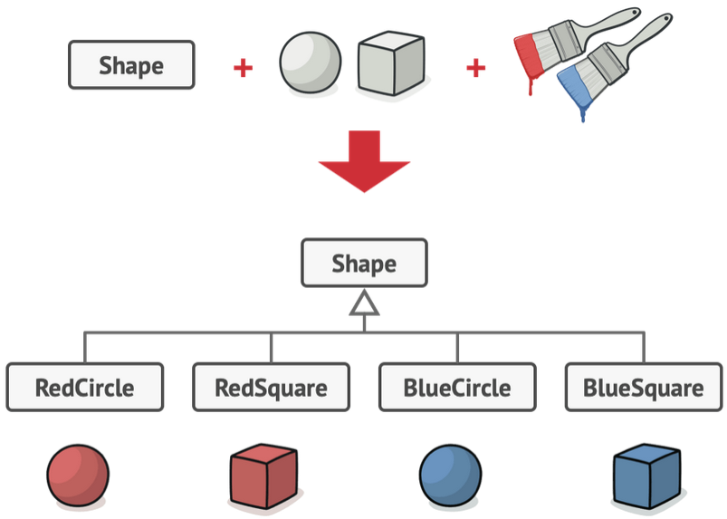

# Bridge
## Intento
Il *Bridge* è un design pattern strutturale che permette di suddividere una grossa classe o un insieme di classi strettamente collegate in due gerarchie diverse, astrazione e implementazione, che possono essere modificate e sviluppate indipendentemente tra loro. 
## Motivazione
Quando abbiamo un'astrazione che può avere diverse possibili implementazioni
Consideriamo una classe che rappresenta una figura geometrica `Shape` che ha un paio di sottoclassi `Circle` e `Square`. Supponiamo di volere incorporare anche alcuni colori che questa figura può assumere, add esempio rosso e blu. La prima cosa che viene in mente è implementare una sottoclasse `Blue` e una sottoclasse `Red`. Dato che ci sono già le sottoclassi `Circle` e `Square` si rende necessario creare quattro combinazioni totali: `RedCircle`, `RedSquare`, `BlueCircle` e `BlueSquare`. È facile vedere come l'aggiunta di nuovi colori o nuove figure aumenta esponenzialmente il numero di sottoclassi.

Questo problema deriva dal fatto che si cerca di estendere la classe `Shape` seguendo due dimensionii indipendenti: forma e colore. Il *Bridge* cerca di risolvere il problema usando la composizione al posto dell'ereditarietà. Si estrae cioè una delle dimensioni in una gerarchia di classi separata in modo che la classe originale conterrà un riferimento ad un oggetto della nuove gerarchia. 

Tornando al nostro esempio potremmo estrarre il colore delle figure in una classe separata `Color` che avrà le sottoclassi `Red` e `Blue`. La classe `Shape` terrà un riferimento a `Color` che a run-time sarà un'istanza di `Red` o `Blue`. In questo modo la classe `Shape` potrà delegare ogni operazione che coinvolge il colore alla classe `Color`. Il riferimento fa da **ponte** (bridge) tra la classe `Shape` e la classe `Color` e aggiungere nuovi colori non comporterà la modifica della gerarchia con radice `Shape`.

## Soluzione
Il design pattern *Bridge* suggerisce di adottare i seguenti ruoli
- **Abstraction**: definisce l'interfaccia per i client e mantiene un riferimento ad un oggetto di tipo *Implementor*. *Abstraction* inolta le richieste del client al riferimento a *Implementor* che mantiene.
- **RefinedAbstraction**: estende l'interfaccia definita da *Abstraction*.
- **Implementor**: definisce le classi che rappresentano l'implementazione.dell'astrazione rappresentata da *Abstraction*. *Implementor* implementa operazioni di più basso livello mentre *Abstraction* implementa operazioni di più alto livello che si basano sulle operazioni definite in *Implementor*.
- **ConcreteImplementor**: implementa l'interfaccia definita da *Implementor*.
---
## Diagramma UML delle classi

---
## Conseguenze
L'uso del *Bridge* permette a un'implementazione di non essere accoppiata ad un'interfaccia la cui implementazione potrebbe essere modificata e configurata anche a run-time con la conseguenza che una volta cambiata l'implementazione non c'è il bisogno di ricompilare l'astrazione *Abstraction* e i client.