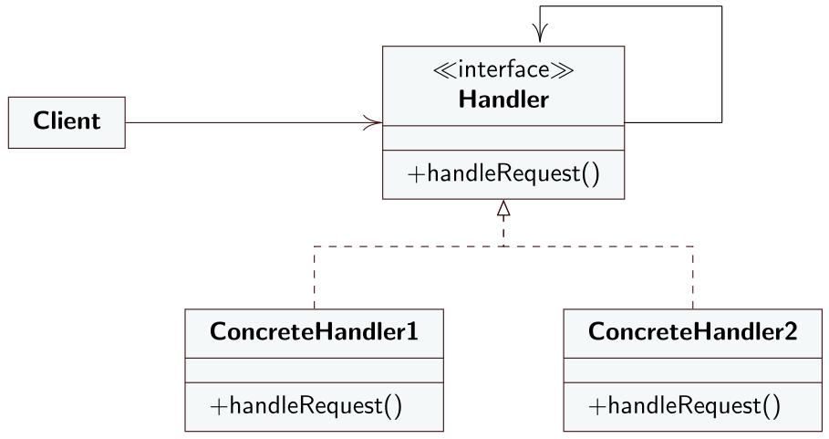

# Chain of Responsability
Il Chain of Responsability è un design pattern comportamentale che permette di passare una richiesta mandata da un client lungo una catena di oggetti che gestiscono richieste (handlers). Alla ricezione di una richiesta ogni ciascun handler decide se processare la richiesta o passarla al prossimo handler lungo la catena.
## Intento
L'intento del design pattern Chain of Responsability è quindi quello di rimuovere l'accoppiamento tra l'oggetto che effettua una richiesta e l'oggetto che gestisce la richiesta. Gli oggetti che gestiscono richieste vengono organizzati in una catena sulla quale viene passata la richiesta finché non arriva un oggetto che può gestirla.
## Motivazione
Consideriamo un situazione in cui si vuole implementare un sistema che mostri messaggi di aiuto in un'interfaccia grafica. L'utente può ottenere informazioni semplicemente cliccando direttamente sulla parte di interfaccia a cui è interessato. Il messaggio d'aiuto mostrato dipende dalla parte dell'interfaccia cliccata e dal suo contesto e se per uno specifico elemento dell'interfaccia non è definito un messagiio d'aiuto allora viene mostrato quello dell'elemento immediatamente vicino o quello dell'intera finestra.

Il problema maggiore che si pone nell'implementazione di tale sistema è che lo specifico oggetto che fornisce il messaggio d'aiuto non è conosciuto dall'oggetto che effettua la richiesta. Serve quindi un metodo che permetta di disaccoppiare l'oggetto che genera la richiesta e l'oggetto che potrebbe soddisfare la richiesta. 
## Soluzione
Il design pattern Chein of Responsabilty definisce i seguenti ruoli
- **Handler**: ruolo che definisce un'interfaccia comune a tutti le classi che gestiscono le richieste. Dichiara il metodo `handleRequest()` che viene implementato dai *ConcreteHandlers* e che contiene la logica che gestisce la richiesta in arrivo. Mantiene un riferimento a se stesso che rappresenta il prossimo *ConcreteHandler* nella catena. 
- **ConcreteHandler**: implementa l'interfaccia *Handler* e si occupa di gestire le richieste in arrivo. Se è in grado di gestire la richiesta lo fa altrimenti richiama il metodo *HandleRequest* al riferimento mantienuto in *Handler* che rappresenta il prossimo *Handler* nella catena. In certe situazioni si potrebbe anche implementare una catena in cui ogni *ConcreteHandler* gestisce la richiesta e la passa al prossimo *ConcreteHandler*.
- **Client**: il client sceglie un *ConcreteHandler* o costruisce una catena dinamicamente a cui passare richieste. La richiesta può essere passata ad un qualsiasi handler nella catena e non deve essere passata necessariamente al primo. 

---
## Diagramma UML delle classi

---
## Conseguenze
L'applicazione del design pattern Chain of Responsability permette di ridurre l'accoppiamento tra oggetti. Un oggetto non ha conoscenza di quale altro oggetto gestirà la propria richiesta. Di conseguenza l'oggetto che gestisce la richiesta e l'oggetto che emette la richiesta non si conoscono a vicenda; inoltre ciascun oggetto della catena non conosce gli oggetti successivi e precedenti della catena. Quindi ogni oggetto non manterrà riferimenti a tutti gli altri oggetti ma solamente al suo successore.

Si ha una flessibilità maggiore nell'assegnazione di responsabilità agli oggetti. Si possono aggiungere o rimuovere responsabilità alle classi che gestiscono le richieste modificando la catena di handler a run-time.

D'altro canto, però, non c'è garanzia che una richiesta mandata lungo la catena venga soddisfatta. Potrebbe arrivare alla fine della catena senza essere gestita da nessun handler.

Il Chain of Responsability è spesso usato con il pattern Composite. Gli oggetti composti possono essere trattati come una catena. Quando un oggetto semplice appartenente ad una composizione riceve una richiesta la può passare su per la gerarchia di oggetti composti.