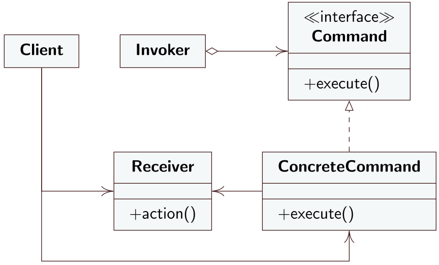

# Command
## Intento
Il Command è un design pattern compartamentale che permette di trasformare una richiesta in un oggetto indipendente che contiene tutte le informazioni riguardanti la richiesta in questione. Questo permette di passare la richiesta come argomenti di un metodo, ritardare o accodare l'esecuzione delle richieste e disaccoppiare l'oggetto che genera la richiesta dall'oggetto che la processa. 
## Motivazione
A volte si rende necessario effettuare richieste ad oggetti senza avere conoscenza dell'operazione richiesta o dell'oggetto che deve gestire la richiesta. Ad esempio un toolkit di un'interfaccia grafica contiene diversi oggetti come bottoni e menu che generano richieste in risposta a input da parte dell'utente. Le richieste che tali elementi generano, però, non possono essere implementate esplicitamente perché dipendono dall'applicazione che li usa. Nell'implementazione del toolkit quindi non si sa il ricevente della richiesta o in cosa la richiesta consiste.
## Soluzione
Il Command definisce i seguenti ruoli
- **Client**: il *Client* è responsabile della creazione di oggetti di tipo *Command* che consiste in un'insieme di azioni da effettuare su un *Receiver*. Ogni *Command* creato, quindi, deve avere settato il proprio *Receiver*.
- **Command**: dichiara un'interfaccia comune a tutti i *ConcreteCommand*. Un comando viene invocato attraverso il metodo `execute()` che richiede al *Receiver* di effettuare certe operazioni. Potrebbe anche implementare un metodo `undo()` che può fare un reverse dell'azione eseguita dal metodo `execute()`. Per far ciò i *ConcreteCommand* devono mantenere il proprio stato prima dell'esecuzione del metodo `execute()`.
- **ConcreteCommand**: crea un accoppiamento tra un azione da effettuare l'oggetto *Receiver* su cui l'azione deve essere compiuta. Un oggetto *Invoker* effettua una richiesta invocando il metodo `execute()` implementato dal *ConcreteCommand* che la soddisfa richiamando uno o più metodi del *Receiver*.
- **Invoker**: mantiene al suo interno un riferimento ad un oggetto di tipo *Command* a cui richiede, ad un certo punto, di "trasportare" la richiesta richiamando il metodo `execute()`. Implementa il metodo `setCommand(Command)` che il *Client* invoca per accoppiare l'*Invoker* ad uno specifico *Command*. Il *Client* crea un oggetto di tipo *Command*. Effettua una chiamata al metodo  `setCommand(Command)` per memorizzare l'oggetto creato all'interno dell'*Invoker*. Quando è pronto per effettuare la richiesta il *Client* richiama il metodo `execute()` sul *Command* attraverso l'*Invoker*. 
- **Receiver**: rappresenta la classe che soddisfa la richiesta invocata.
---
## Diagramma UML delle classi


---
## Conseguenze
Applicare il *Command* pattern permette di disaccoppiare l'oggetto che invoca l'operazione da eseguire dall'oggetto che deve effettuare l'operazione. Le oeprazioni diventano oggetti manipolabili, passabili come parametri a metodi e componibili. Un *Command* può essere incorporato all'interno di un altro *Command* applicando il design pattern *Composite*. per aggiungere nuove operazioni basta creare una nuova classe e non bisogna modificare in modo sostanziale codice già esistente. 
## Esempio
```java
// Command
public interface Command {
	public void execute();
}
```

```java
// ConcreteCommand
public class LightOnCommand implements Command {
	Light light; 
	
	public LightOnCommand(Light light) { // nel costruttore viene passato l'istanza specifica di Light che il concretecommand controllerà. Rappresenta il receiver della richiesta
		this.light = light;
	}
	public void execute() { // il metodo execute richiama il metodo on() sul receiver, cioè l'istanza di Light
		light.on();
	}
}
```

```java
// Invoker
public class SimpleRemoteControl {
	Command slot;
	
	public SimpleRemoteControl() {}
	
	public void setCommand(Command command) {
		slot = command;
	}

	public void buttonWasPressed() {
		slot.execute();
	}
}
```

```java
// Main
public class RemoteControlTest {
	public static void main(String[] args) {
		SimpleRemoteControl remote = new SimpleRemoteControl();
		Light light = new Light();
		LightOnCommand lightOn = new LightOnCommand(light);
		remote.setCommand(lightOn);
		remote.buttonWasPressed();
	}
}
```