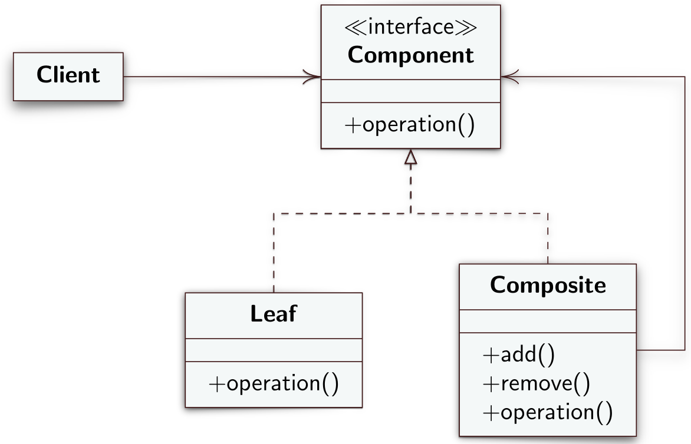

# Composite
Il Composite è un design pattern strutturale che permette di comporre oggetti in strutture ad albero con cui è possibile lavorare come fossero singoli oggetti.
## Intento
L'intento dei design pattern Composite è quello di permettere allo sviluppatore di rappresentare oggetti semplici e aggregati uniformemente in modo che il client non debba sapere se l'oggetto con cui sta lavorando è semplice o composto. La necessità di uniformare oggetti semplici e composti si potrebbe verificare  ad esempio nel caso in cui si ha un editor grafico di figure. Un utente può raggruppare insieme figure semplici come linee in una figura composta ad esempio un quadrato, cerchio ecc. Tutte le operazioni disponibili sulle figure semplici devono essere disponibili uniformemente anche sulle figure composte.
## Motivazione
Come già menzionato si potrebbe avere una situazione in cui è necessario raggruppare tra loro elementi semplici per comporre elementi più complessi. La distinizione tra componenti semplici e aggregati di componenti semplici rende il codice più complesso e difficile da leggere, si rende quindi necessario un meccanismo che uniformi le operazioni che si possono svolgere sia su  elementi semplici che elementi composti. Tramite il Composite è possibile anche definire una composizione **ricorsiva** in modo che i client non facciano alcuna distizione tra tipi di elementi semplici e composti.
## Soluzione
Il design pattern Composite definisce i segueni ruoli
- **Component**: un'interfaccia che dichiare le operazioni comuni che si possono richiamare sia su oggetti semplici che oggetti composti. Questa viene imlpementata dalle classi *Leaf* e *Composite* che avranno ognuna un'opportuna imlementazione dei metodi definiti in *Component*.
- **Leaf**: è un’implementazione di Component e rappresenta gli oggetti semplici. Ci saranno tanti Leaf quanti oggetti semplici si vogliono implementare
- **Composite**: ruolo che rappresenta gli oggetti composti da oggetti semplici *Leaf* o, ricorsivamente, da altri oggetti composti. Tiene al suo interno una lista di oggetti *Component* (che rappresentano gli oggetti che lo compongono) per implementare i metodi ereditati. In particolare l'implementazione di tali metodi da parte del *Composite* consiste nel richiamarli su tutti gli oggetti semplici o composti (*Leaf* o *Composite*) che lo compongono. Il *Composite* inoltre implementa i metodi `add()` e `remove()`. Il primo permette di aggiungere un'istanza di *Leaf* o un'altra istanza di *Composite* all'aggregazione mentre il secondo permette di togliere un elemento dall'aggregazione. Il client, che viene legato solamente all'interfaccia *Component*, non potrà richiamare i metodi `add()` e `remove()` perché dichiarati ed implementati solamente in *Composite*. Per permettere la loro invocazione, quindi si rende necessario per il client istanziare la classe *Composite* rinunciando alla trasparenza offerta da *Component* e legandosi ad un sottotipo di *Component*. Una variante del design pattern che risolve il problema implementa i due metodi in *Component* rendendola una classe astratta. Questa soluzione aumenta la trasparenza ma diminuisce la sicurezza perché se a run-time l’oggetto *Component* diventa un’istanza di tipo *Leaf*, c'è il rischio di chiamare il metodo `add()` su un oggetto semplice che il metodo non lo implementa. La lista degli elementi aggregati deve essere comunque all'interno della classe *Composite* che, quindi, implementerà i due metodi mentre in *Component* saranno vuoti in modo che se richiamati si *Leaf* non facciano nulla.

Alla chiamata del metodo `operation()` su un oggetto *Composite* scattano una serie di chiamate del metodo stesso sugli elementi della lista che memorizza gli oggetti semplici aggregati. La catena di chiamate potrebbe essere onerosa in termini computazionali. Per risolvere il problema si potrebbe implementare una sorta di cache all'interno di *Composite* che memorizza l'ultimo valore calcolato dalla chiamata di `operation()` e lo restituisce alle successive chiamate se lo stato della composizione non è cambiato, altrimenti ricalcola il valore da restituire. 

È possibile anche implementare un metodo `getComposite()` in *Leaf* che ritorna l'oggetto *Composite* a cui appartiene.

---
## Diagramma UML delle classi

---
## [Esempio](https://www.dmi.unict.it/tramonta/se/oop/appCart.html)