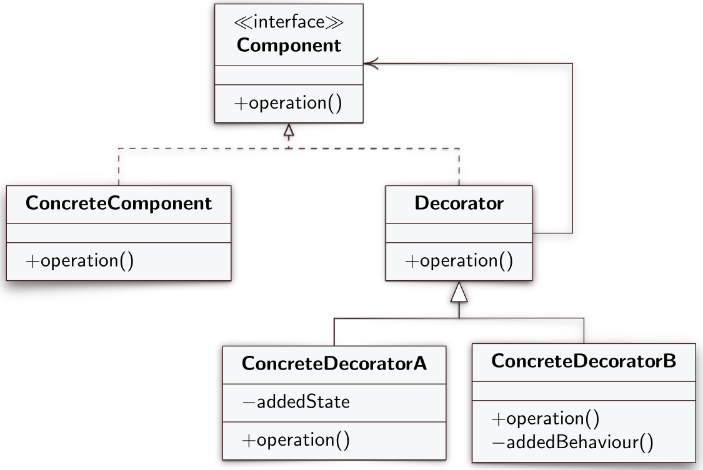
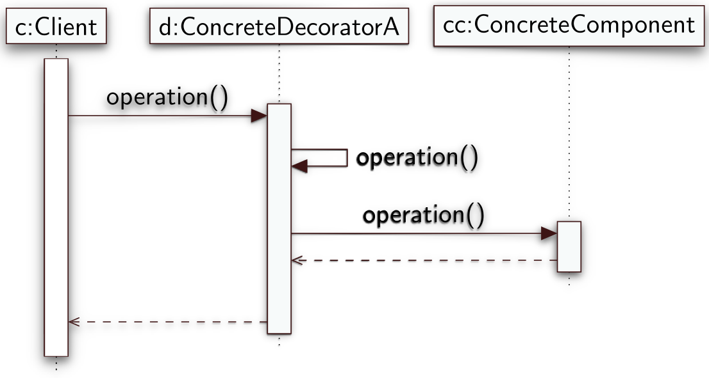

# Decorator
Il Decorator è un design pattern strutturale che permette di assegnare nuovi comportamenti ad un oggetto inserendolo dentro un altro oggetto wrapper che contiene detti comportamenti.
## Intento
Il Decorator permette di aggiungere o togliere responsabilità ad un oggetto a run-time dove con responsabilità intendiamo implementazione di metodi. La prima cosa che verrebbe in mente quando si vogliono aggiungere funzionalità ad un oggetto è implementare delle sottoclassi che implementano le nuove funzionalità. La soluzione che fa uso di ereditarietà, però, presenta il grosso problema che l’ereditarietà è statica. Non si può alterare il comportamento di un oggetto a run-time ma si può solo rimpiazzare l’intero oggetto con un altro istanziato da una sottoclasse. Inoltre le sottoclassi possono avere una sola superclasse.
## Motivazione
Potrebbe crearsi una situazione in cui si vuole aggiungere ad un singolo oggetto e non ad un'intera classe nuove responsabilità e funzionalità oppure togliere responsabilità e funzionalità. La risoluzione del problema attraverso l'ereditarietà permette solamente di aggiungere nuove funzionalità e non offre alcuna flessibilità perché un client non ha il controllo di come e quando "decorare" l'oggetto.

L'uso di un oggetto wrapper permette ai client di modificare il comportamento di un oggetto in modo trasparente, senza cioè essere a conoscenza della presenza del wrapper.
## Soluzione
Il Decorator definisce i seguenti ruoli
- **Component**: definisce un'unterfaccia comune agli oggetti semplici e oggetti decorati. Dichiara un certo numero di metodi `operation()` che vengono implementati dalle classi *ConcreteComponent* e *ConcreteDecorator*.
- **ConcreteComponent**: oggetto di base a cui si possono aggiungere "decorazioni".
- **Decorator**: classe che implementa in maniera differente dal *ConcreteComponent* la superclasse *Component* . Mantiene al suo interno un riferimento di tipo *Component* e di conseguenza implementa il metodo `operation()`. Nell'implementazione del metodo richiama il metodo stesso sul riferimento a *Component*. Il *Decorator* ha un costruttore che prende in ingresso un parametro di tipo *Component* che a run-time sarà un'istanza di tipo *ConcreteComponent* o uno dei *ConcreteDecorator*. Per istanziare un *ConcreteComponent* basterà farlo attraverso `new ConcreteComponent()` ma per istanziare un *ConcreteDecorator* bisogna ricordarsi che la sua superclasse ha come parametro del costruttore un *Component*, quindi dobbiamo necessariamente passargli, nel caso più semplice, l'istanza del *ConcreteComponent* su cui deve operare (a cui deve aggiungere funzionalità). 
- **ConcreteDecorator**: redifinisce i comportamenti di base del *ConcreteComponent*. Sono sottoclassi di *Decorator*. Ci sarà un *ConcreteDecoretor* per ogni nuova funzionalità che si vuole aggiungere al *ConcreteComponent*. Ridefiniscono il metodo `operation()`. L'interfaccia dei *ConcreteDecorator* deve rimanere uguale all'interfaccia del *ConcreteComponent* quindi nel caso in cui si necessiti l'implementazione di nuovi metodi, questi dovranno essere privati e non accessibili dall'esterno. Nell'implementare `operation()` si servono dell'invocazione del metodo stesso sulla loro superclasse *Decorator*. 
 

--- 
## Diagramma UML delle classi


---
## Diagramma di sequenza

Quando il client richiama il metodo `operation()` su un *ConcreteDecorator* quest'ultimo richiama `operation()` su stesso referenziando però la superclasse *Decorator*. *Decorator*, a sua volta, richiama `operation()` sull'istanza di *ConcreteComponenet* che mantiene al suo interno attraverso l'interfaccia *Component*. 

---
## Implementazione
```java
interface Component {
	public void operation();
}
```

```java
class ConcreteComponent implements Component {
	@Override public void operation() {
		// ...
	}
}
```

```java
class Decorator implements Component {
	private final Component innerC;
	public Decorator(final Component c) {
		innerC = c;
	}
	@Override public void operation() {
		innerC.operation();
	}
}
```

```java
class ConcreteDecorator extends Decorator {
	public ConcreteDecorator(Component c) {
		super(c);
	}
	@Override public void operation() {
		super.operation();
		// ...
	}
}
```

```java
// Main
Component c = new ConcreteDecorator(new ConcreteComponent);
```
## Conseguenze
L'uso del Decorator offre più flessibilità rispetto all'ereditarietà poiché i client possono aggiungere e combinare responsabilità in modo dinamico senza effettivaemnte mantenere un'istanza per ogni nuova responsabilità aggiunta. Permette di estendere il comportamento di un oggetto senza la necessità di creare nuove sottoclassi. Permette di combinare più comportamenti incapsulando l'oggetto in diversi *Decorator*.