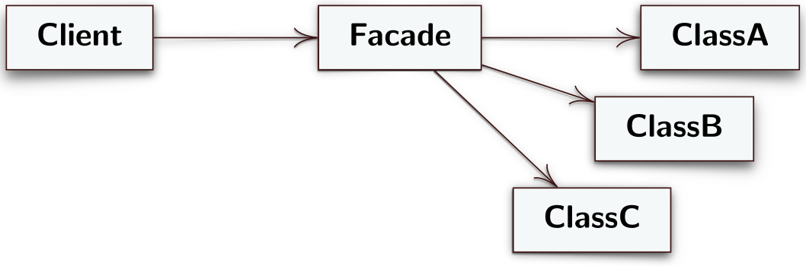

# Facade
Il facade è un design pattern strutturale che permette di mascherare dietro ùna semplice interfaccia un codice strutturalmente più complesso.
## Intento
L'intento del facade è quello di fornire alle classi client un'interfaccia unificata al posto di un insieme di interfacce di un sottosistema composto da un'insieme abbastanza complesso di classi. Lo scopo principale, quindi, è quello di semplificare l'utilizzo del sottosistema complesso attraverso una facciata più semplice che non mostra tutta la struttura sottostante.
# Problema
Spesso una singola componente di un software è composta da un insieme di classi con complesse relazioni fra loro. Se una classe client deve interagire con la componente dovrebbe tenere un'istana di ciascuna classe oppure capire qual'è la classe fondamentale che le serve per l'interazione. Questo crea forti dipendenze dirette fra client e sottosistema rappresentato dalla componente.
## Soluzione
Il design pattern facade stabilisce i seguenti ruoli per risolvere il problema descritto
- **Facade**: classe che fornisce un'interfacciasemplificata e di alto livello che i client possono utilizzare per interagire con il sottosistema. Analogamente al design pattern [Adapter](./Adapter.md) il facade svolge un ruolo di *"middle-man"* cioè riceve le richieste del client e le gira alle giuste classi del sottosistema seguendo un flusso di richieste richiesto dal client. Inoltre per rendere le classi del sottosistema non accesisbili al client si possono direttamente annidare direttamente all'interno della classe *Facade*. Il problema di questa tecnica è che la leggibilità del codice diminuisce drasticamente se le classi annidate sono complesse.
- **Client**: utilizza l'interfaccia *Facade* per interagire con il sottosistema. È completamente indipendente dal sottsistema. 

---
## Diagramma UML delle classi


---
## Esempio
```java
public class Client {
	public static void main(String args[]) {
		Translator t = new Translator();
		t.addEnglish("Hello");
		t.multiPrinting();
	}
}
```

```java
// Ruolo Facade
public class Translator { 
	private English e = new English();
	private Italian i = new Italian();

	public void addEnglish(String s) {
		if (e.test(s)) {
			e.add(s);
			i.add(e.getIndex(s));
	}

	public void multiPrinting() {
		System.out.print("Italiano: ");
		i.printText();
		System.out.print("English: ");
		e.printText();
	}
}
```

```java
// Sottosistema
public class English {
	private String text = " ";
	private List<String> d =
		Arrays.asList("Alright", “Hello",
					  "Understood", "Yes");
	
	public boolean test(String s) {
		return d.contains(s);
	}

	public void add(String s) {
		text = text + " " + s;
	}

	public String getText() {
		return text;
	}

	public int getIndex(String s) {
		return d.indexOf(s);
	}

	public void printText() {
		System.out.println(text);
	}
}

public class Italian {
	private String text = " ";
	private List<String> d =
		Arrays.asList("Va bene", "Ciao",
					  “Capito", "Sì");

	public void add(int i) {
		text = text + " " + d.get(i);
	}

	public void printText() {
		System.out.println(text);
	}
}
```

## Conseguenze
Il design pattern facade nasconde dietro una semplice interfaccia la complessità del sottosistema con cui il client deve intergagire. Come conseguenza vengono ridotte le dipendenze di compilazione in sistemi software di grandi dimensioni. Se si cambia una classe del sottosistema possiamo ricompilare solo il codice compreso fino alla classe *Facade* senza toccare le classi client. 