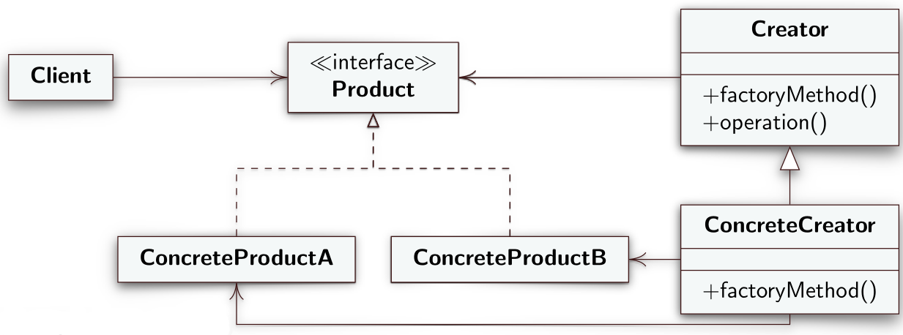
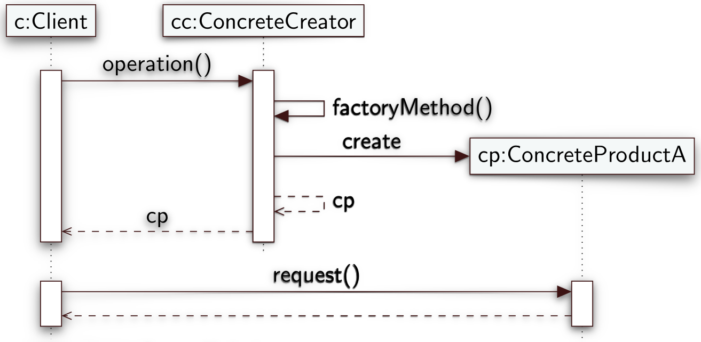

# Factory Method
Il factory method è un design pattern creazionale che come dice il nome "fabbrica istanze" di classi.
## Intento
Lo scopo del factory method è quello di creare un'interfaccia per la creazione di oggetti ma senza prendere alcuna decisione su che tipo di oggetto istanziare. La decisione del tipo di oggetto da istanziare viene rimandata alle sottoclassi che implementano l'interfaccia.
## Problema
Supponiamo di progettare un framework, cioè uno starto di sistema software che deve essere utile per la costruzione di oggetti da parte del software sottostante ma senza sapere in anticipo il tipo degli oggetti che verranno costruiti. Il framework deve, quindi, predisporre metodi per la creazione di istanze ma lasciare che siano le sue sottoclassi a decidere il tipo delle istanze da creare.
## Soluzione
I ruoli stabiliti dalla soluzione dei factory method sono:
- **Product**: è il ruolo dell'interfaccia comune di tutti gli oggetti che possono essere istanziati dal client.
- **ConcreteProduct**: è il ruolo che svolge la classe che implementa l'interfaccia *Product*.
- **Creator**: predispone il punto di richiesta dell'istanza da parte del client ma rimanda alle sottoclassi la decisione di quale istanza creare. Praticamente riceve una richiesta di creazione di un *Product* attraverso il metodo non implementato `factoryMethod()` ma lascia decidere alle sue sottoclassi che tipo di *ConcreteProduct* istanziare.
- **ConcreteCreator**: la sottoclasse di *Creator* che decide il tipo di istanza da creare attraverso l'implementazione del metodo `factoryMethod()` che ritorna un *ConcreteProduct*. Questa classe sarà l'unica che conoscerà le imlpementazioni di *Concreteproduct*.

---
### Diagramma UML delle classi



---
### Diagramma di sequenza



## Varianti
- I ruoli di *ConcreteCreator* e *Creator* vengono svolti dalla stessa classe come nell'esempio a seguire.
- Si dichiara il `factoryMethod()` come `static` in modo da permettere al client di richiamarlo sulla classe *Creator* e non su una sua istanza.
- Si implementa il `factoryMethod()` in modo che prenda in input un certo parametro che permetta al client di suggerire il tipo di classe da istanziare.
- Il `factoryMethod()` potrebbe utilizzare dei costrutti che vanno sotto il nome di **Riflessione Computazionale**. Questi sono meccanismi che permettono di scrivere codice che ha al suo interno ragionamento sul codice stesso. Ad esempio con il metodo statico `forName()` della classe `Class` è possibile ottenere una classe a partire da una stringa uguale al nome della classe che si vuole istanziare.

### Esempio riflessione computazionale
```java
try {
	Class<?> cls = Class.forName("Studente"); // Se esiste una classe che ha nome Studente, Class prenderà il tipo di Studente
	Constructor<?> cnstr = cls.getConstructor(new Class[] {}); // Ritorna il costruttore della classe Studente
	return (IStudente) cnstr.newInstance(); // Ritorna una nuova istanza di Studente
}
catch (InstantiationException | IllegalAccessException | IllegalArgumentException |
InvocationTargetException | NoSuchMethodException | SecurityException |
ClassNotFoundException e) {
	e.printStackTrace();
}
```
--- 

## Conseguenze
Come conseguenze dell'applicazione del factory method il codice delle classi dell'applicazione conosce solo l'interfaccia *Product* e può lavorare con qualsiasi ConcreteProduct che sono facilmente intercambiambili.

## Dependency Injection
Potrebbe capitare l'istanza di una classe che svolge il ruolo di *ConcreteProduct* abbia bisogno di lavorare con istanze di altre classi e che quindi ha delle dipendenze. Un buon modo di far conoscere al *ConcreteProduct* le classi da cui dipende è passandogliele attraverso il suo costruttore. In questo modo le classi da cui il *ConcreteProduct* dipende gli vengono "iniettate" al momento della sua creazione.

La tecnica del dependency injection permette di separare la costruzione delle istanze dal loro uso

[Esempio dependency injection](https://www.dmi.unict.it/tramonta/se/oop/appEditor.html)
## Esempio
```java
/* La classe IStudente svolge il ruolo di Product*/
public interface IStudente {
	public void nuovoEsame(String m, int v);
	public float getMedia();
}
```

```java
/* Studente prende il ruolo di uno dei ConcreteProduct che implementa Product */
public class Studente implements IStudente {
	private List<Esame> esami = new ArrayList<>();
	
	public void nuovoEsame(String m, int v) {
		Esame e = new Esame(m, v);
		esami.add(e);
	}
	
	public float getMedia() {
		if (esami.isEmpty()) return 0;
		float sum = 0;
		for (Esame e : esami) sum += e.getVoto();
		return sum / esami.size();
	}
}
```

```java
/* Sospeso prende il ruolo di uno dei ConcreteProduct che implementa Product */
public class Sospeso implements IStudente {
	private float media;
	
	public Sospeso(float m) {
		media = m;
	}
	
	public void nuovoEsame(String m, int v) {
		System.out.println("Non e' possibile sostenere esami");
	}
	
	public float getMedia() {
		return media;
	}
}
```

```java
/* Crea i concrete product. Notare come StCreator svolge il ruolo sia di ConcreteCreator. Questa è una variante ammissibile del FactoryMethod in cui viene omesso il Creator ed implementato solo il ConcreteCreator.*/
public class StCreator{
	private static boolean a = true;
	
	public static IStudente getStudente(){
		if(a)
			return new Studente();
		return new Sospeso(0);
	}
}
```

```java
public class Client {
	public void registra(){
		IStudente s = StCreator.getStudente();
		s.nuovoEsame("Maths", 8);
	}

}
```

## Object Pool
Un'altra tecnica che si sposa bene con il factory method è l'**object pool**. Un object pool non è altro che un deposito di istanza già create che possono essere usate dalle classi client su richiesta. Quando una classe client ha finito di utilizzare l'istanza questa viene reintrodotta dentro il pool, il suo stato resettato e quando non ci sono più istanze dentro il pool non ne vengono create di nuove. L'idea di base è quella di riutilizzare certi oggetti istanziati preventivamente.

Il riutiizzo delle istanza è utile ad esempio quando l'istanza è onerosa da creare e quindi pesa eccessivamente sulla computazione a runtime.
### Esempio
```java
import java.util.ArrayList;
import java.util.List;
// CreatorPool è un ConcreteCreator e implementa un Object Pool
public class CreatorPool {
	private List<Shape> pool = new ArrayList<>();
	// metodo factory che ritorna un oggetto prelevato dal pool
	public Shape getShape() {
		if (pool.size() > 0)
			return pool.remove(0);
		return new Circle();
	}
	// inserisce un oggetto nel pool
	public void releaseShape(Shape s) {
		pool.add(s);
	}
}
```
