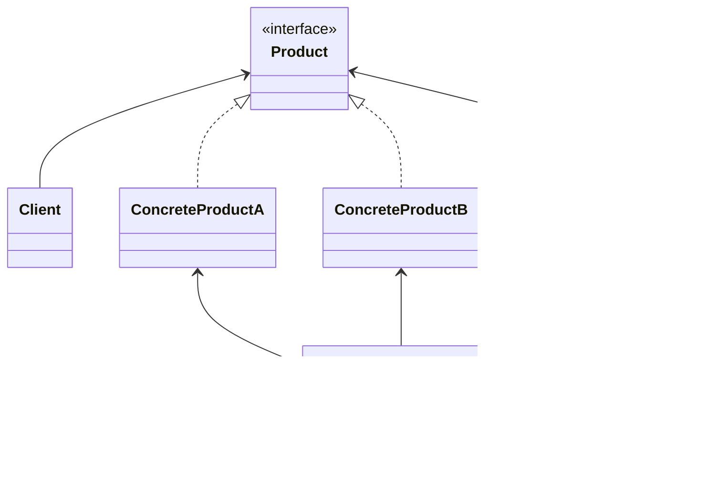

# Factory Method

```mermaid
classDiagram
	class Product
	<<interface>> Product
	class Client
	class ConcreteProductA
	class ConcreteProductB
	class Creator
	Creator: +factoryMethod()
	Creator: +operation()
	class ConcreteCreator
	ConcreteCreator: +factoryMethod()
	Product <-- Client
	Product <-- Creator
	Product <|.. ConcreteProductA
	Product <|.. ConcreteProductB
	ConcreteProductA <-- ConcreteCreator
	ConcreteProductB <-- ConcreteCreator
	Creator <|-- ConcreteCreator
```

