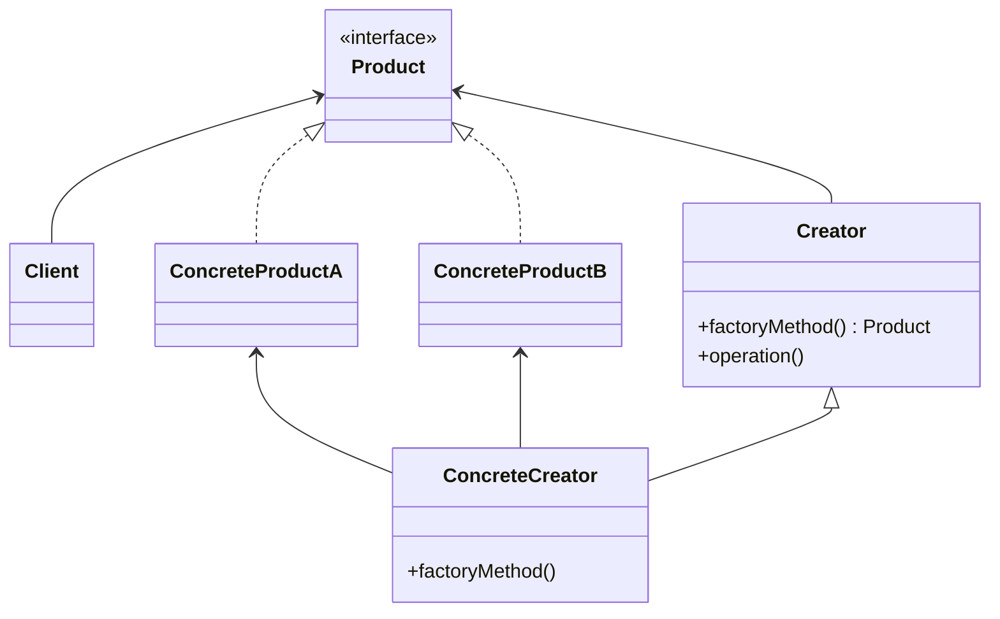
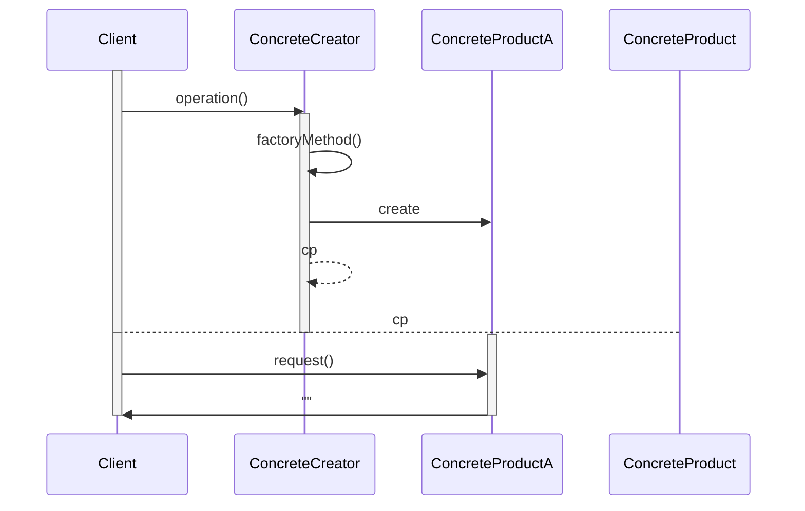

# Factory Method
Il factory method è un design pattern creazionale che come dice il nome "fabbrica istanze" di classi.
## Intento
Lo scopo del factory method è quello di creare un'interfaccia per la creazione di oggetti ma senza prendere alcuna decisione su che tipo di oggetto istanziare. La decisione del tipo di oggetto da istanziare viene rimandata alle sottoclassi che implementano l'interfaccia.
## Problema
Supponiamo di progettare un framework, cioè uno starto di sistema software che deve essere utile per la costruzione di oggetti da parte del software sottostante ma senza sapere in anticipo il tipo degli oggetti che verranno costruiti. Il framework deve, quindi, predisporre metodi per la creazione di istanze ma lasciare che siano le sue sottoclassi a decidere il tipo delle istanze da creare.
## Soluzione
I ruoli stabiliti dalla soluzione dei factory method sono:
- **Product**: è il ruolo dell'interfaccia comune di tutti gli oggetti che possono essere istanziati dal client.
- **ConcreteProduct**: è il ruolo che svolge la classe che implementa l'interfaccia *Product*.
- **Creator**: predispone il punto di richiesta dell'istanza da parte del client ma rimanda alle sottoclassi la decisione di quale istanza creare. Praticamente riceve una richiesta di creazione di un *Product* attraverso il metodo non implementato `factoryMethod()` ma lascia decidere alle sue sottoclassi che tipo di *ConcreteProduct* istanziare.
- **ConcreteCreator**: la sottoclasse di *Creator* che decide il tipo di istanza da creare attraverso l'implementazione del metodo `factoryMethod()` che ritorna un *ConcreteProduct*.

