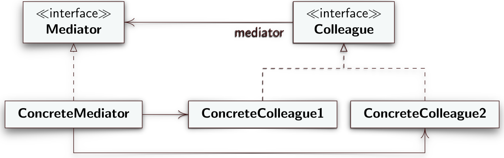

# Mediator
Il Mediator è un design pattern comportamentale che permette di ridurre dipendenze caotiche tra oggetti limitando comunicazioni dirette tra gli oggetti e forzandoli a comunicare esclusivamente attraverso un oggetto mediatore.
## Intento
Il Mediator, quindi, stabilisce un oggetto che centralizza le interazioni tra diversi oggetti che altrimenti dovrebbero interagire direttamente tra loro creando forti dipendenze. Il Mediator permette di avere un accoppiamento lasco tra i vari oggetti perché evita che questi interagiscano tra di loro e permette di modificare il modo in cui interagiscono senza andare a toccare il codice degli oggetti stessi.
## Motivazione
Una distribuzione di responsabilità su diverse classi porta spesso ad avere un numero elevato di oggetti fortemente connessi tra di loro e nel caso peggiore ciascuna classe dovrà mantere al suo interno un istanza di tutte le altri classi che porta ad avere un sistema software monolitico e difficile da modificare.  
## Soluzione
Il Mediator suggerisce i seguenti ruoli
- **Colleague**:
- **Mediator**:
- **ConcreteMediator**: mantiene un riferimento a ciascuno dei *ConcreteColleague*. Quando riceve un'invocazione da un *ConcreteColleague* "traduce" l'evento che gli è stato comunicato in comandi da passare agli altri *ConcreteColleague* secondo una logica definita.
- **ConcreteColleague**: rappresentano le varie classi che se non ci fosse il Mediator interagirebbero tra di loro. Quando un *ConcreteColleague* deve informare gli altri *ConcreteColleague* di un cambiamento di stato o comunque deve comunicare con loro, chiamate ai metodi del *Mediator* che a run-time sarà un'istanza del *ConcreteMediator*. 

---
## Diagramma UML delle classi

---
## Conseguenze
La complessità derivante dalla logica che gestisce l'interazione e le dipendenze tra le varie classi viene centralizzata nel *ConcreteMediator* il che rende più semplice la comprensione, l'implementazione e la riusabilità delle classi. D'altro canto la riusabilità del *Mediator* è nulla perché progettato specificamente per la specifica applicazione.
## [Esempio](https://www.dmi.unict.it/tramonta/se/oop/appGioco.html)