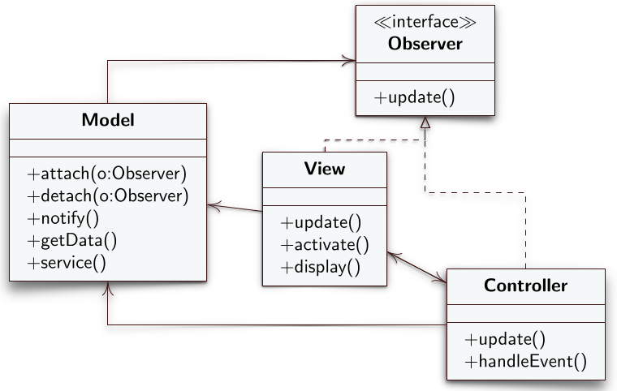

# Observer
L'Observer è un design pattern comportamentale che permette di creare un meccanismo in cui è possibile notificare certi eventi su un oggettto agli oggetti che lo osservano.
## Intento
L'intento dell'Observer, conosciuto anche come *Publish-Subscribe*, è quello di creare una dipendenza uno a molti fra oggetti in modo che quando un oggetto osservato cambia il proprio stato, tutti gli oggetti osservatori che dipendono da esso vengono notificati e aggiornati automaticamente.
## Problema
Come conseguenza del principio di singola responsabilità si ha un sistema software estremamente modulare, diviso cioè in molte classi. Sorge quindi l'esigenza di mettere in relazione fra loro le diverse classi in modo che vengano aggiornate sullo stato della classe che sta portando avanti l'esecuzione del software in quel momento.
## Soluzione
Il design pattern Observer descrive come stabilire le relazioni fra oggetti dipendenti, in paricolare fra un oggetto che detiene i dati (osservato) e diversi oggetti interessati ai dati (osservatori). Stabilisce diversi ruoli tra cui **Subject** e **Observer**. Il primo è quello che contiene lo stato osservato, il secondo è quello che osserva lo stato e deve essere aggiornato dei cambiamenti.
- **Subject**: contiene tre metodi: `attach(Observer)`, `detach(Observer)` e `notify()`. Il primo permette ad un osservatore di comunicare al *Subject* la propria volontà di osservare i dati gestiti dal *Subject* ed essere notificato in caso di aggiornamenti dello stato. Per tenere traccia di tutti gli observer interessati il *Subject* mantiene una lista di tipo *Observer*. Il metodo `detach(Observer)` permette ad un Observer di cancellarsi dalla lista di osservatori e non ricevere più notifiche sui cambiamenti di stato del *ConcreteSubject*. Infine il metodo `notify()` richiama il metodo `update()` dell'interfaccia *Observer* per tutti gli Observer nella lista di osservatori attivi.
- **Observer**: interfaccia che dichiara il metodo `update()`.
- **ConcreteSubject**: ruolo che contiene lo stato osservato e implementa la logica di cambiamento dello stato. Implementa due metodi: `getState()` e `setState()`. Quando aggiorna il proprio stato deve richiamare il metodo `notify()` che eredita dal *Subject* che a sua volta richiamera il metodo `update()` su tutte le istanze di *Observer* memorizzate nella lista di osservatori dentro il *Subject*. Quando un *ConcreteObserver* esegue su se stesso il metodo `update()` capisce che lo stato è cambiato, potrebbe richiamare il metodo `getState()` del *ConcreteSubject* che osserva (variante **pull**) oppure il *ConcreteSubject* stesso può passare lo stato al *ConcreteObserver* come parametro della chiamata `notify()` (variante **push**). Un altro parametro utile che si potrebbe passare al *ConcreteObserver* attraverso la chiamata `notify()` è l'identità del *ConcreteSubject* che sta effettuando la chiamata. Questo perché il *ConcreteObserver* potrebbe essere osservatore di più *ConcreteSubject*. Il metodo `setState()` potrebbe essere utile quando si implementa un *ConcreteObserver* che può modificare lo stato del *ConcreteSubject* che sta osservando. Ad esempio supponiamo che dentro il *ConcreteSubject* ci sia la logica di risoluzione di un'equazione di secondo grado. Contiene, quindi, tra i suoi attributi i parametri *a,b* e *c*. Potremmo avere un *ConcreteObserver* che si occupa della visualizzazione dell'equazione, un'altro che si occupa di visualizzare i valori di *a,b* e *c* e un *ConcreteObserver* che chiede dei parametri all'utente. Tali parametri, ad esempio *a,b* e *c* possono essere passati al *ConcreteSubject* attraverso la chiamata al metodo `setState()` per aggiornarne lo stato.
- **ConcreteObserver**: istanze dell'interfaccia Observer che osservano lo stato di un ConcreteSubject.

---
## Diagramma UML delle classi

---
## Diagramma UML di sequenza

---
## Conseguenze
Il ConcreteSubject non ha bisogno di gestire direttamente le dipendenze ed è lascamente accoppiato solo a chi deve conoscere lo stato. Tramite l'Observer, inoltre separiamo il codice che manda notifiche dal codice che le notifiche le deve ricevere rendendo il software più modulare e semplice da comprendere.

Un compromesso dell'uso dell'Observer è che l'esecuzione del metodo `update()` su tutti i *ConcreteObserver* potrebbe rallentare l'esecuzione del software che deve aspettare la fine dell'esecuzione del metodo.

---
## Reactive Streams
In sostituzione ai tipi `Observable` e `Observer`, in Java 9 sono stati introdotti nella libreria `java.util.concurrent` i tipi `Publisher<T>`, `Subscriber<T>`, `Subscription` e `SubmissionPublisher`. Che, a differenza del metodo vecchio, permettono di far eseguire il metodo update sui *ConcreteObserver* in un thread separato in modo che la chiamata non diventi bloccante per il thread del chiamante.

Il tipo `Subscriber` sostituisce il tipo `Observer` e obbliga alle classi che lo implementano di implementare quattro metodi anziché solamente l'`update()`. In particolare definisce i metodi `onSubscribe()`, `onNext()`, `onError()`e `onComplete()`. Il metodo `onNext()` è l'equivalente del metodo `update()`, il metodo `onError()` viene richiamato quando lato *Subject* c'è stato un errore di qualche tipo, il metodo `onComplete()` viene richiamato per informare un `Subscriber` (Observer) che il flusso di attività lato *Subject* è terminato e quindi non manderà più aggiornamenti sullo stato, infine il metodo `onSubscribe()` viene chiamato per informare il *ConcreteObserver* che la sua registrazione al *Subject* è avvenuta con successo.

Il tipo `Publisher` è un'interfaccia che dichiara il metodo `subscribe()` (usato per registrare istanze di `Subscriber`) e viene implementata dal tipo `SubmissionPublisher`. I *ConcreteSubject* non gestiscono in modo diretto la notifica e i cambiamenti di stato ma lo fanno attraverso un'istanza di `SubmissionPublisher` che tengono memorizzata.
## Model View Controller (MVC)
Il model view controller è un'alternativa al design pattern *Observer* molto ricorrente anche in framework per l'implementazione di applicazioni interattive. Definisce tre componenti principali: **Model**, **View** e **Controller**. Lo scopo del MVC è di suddividere fra loro la presentazione dei dati (View), la logica che aggiorna i dati (Model) e la logica che permette l'interazione con il sistema (Controller). Il ruolo del Model è analogo a quello del *Subject* e *ConcreteSubject* nel design pattern *Observer* mentre *View* e *Controller* svolgono il ruolo di *ConcreteObserver*. 

---
### Diagramma UML delle classi

## Diagramma UML di sequenza

---
