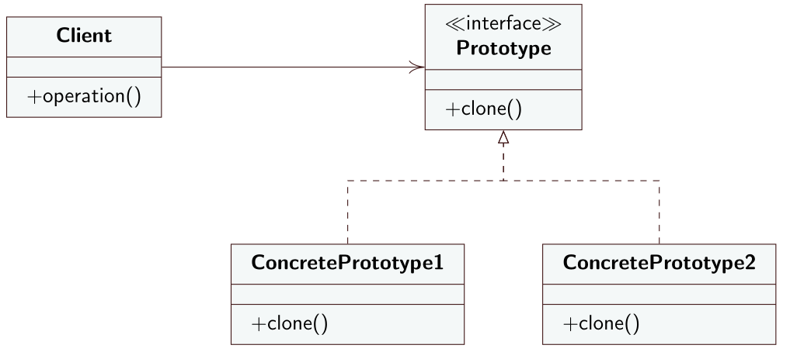

# Prototype
## Intento
Il Prototype è un design pattern creazionale che permette di effettuare la copia di oggetti esistenti senza che il codice dipenda dalle loro classi. Permette quindi di specificare il tipo di oggetti da creare usando un'istanza prototipo e creare nuovi oggetti usando quell'istanza.
## Motivazione
Supponiamo di avere un oggetto di cui vogliamo creare un'esatta copia. Dovremmo prima creare un nuovo oggetto della stessa classe per poi ricopiare tutti gli attributi del vecchio oggetto nell'oggetto nuovo. SI pone subito un problema. L'oggetto da copiare potrebbe avere attributi privati non accessibili dall'esterno della classe. Un'altro problema con questa tecnica è che bisogna conoscere necessariamente il tipo dell'oggetto rendendo il codice dipendente dalla classe dell'oggetto. Volendo ignorare lo stretto accoppiamento rimane comunque il problema che spesso si conosce solamente l'interfaccia a cui l'oggetto appartiene e non la classe concreta.

Il design pattern *Prototype* delega il processo di clonazione all'oggetto stesso da clonare. Il pattern dichiara un'interfaccia comune a tutti gli oggetti che supportano la clonazione. L'interfaccia permette di copiare un oggetto senza accoppiare il codice alla classe dell'oggetto e spesso dichiara un solo metodo `clone(). 
## Soluzione
Il Prototype suggerisce i seguenti ruoli
- **Prototype**: definisce l'interfaccia comune a tutti gli oggetti che devono supportare la clonazione e dichiara il metodo `clone()` che implementa l'operazione di clonazione.
- **ConcretePrototype**: classe dell'oggetto da clonare e che implementa il metodo `clone()`.
- **Client**: il client non dovrà conoscere la classe degli oggetti da clonare, lavorerà solamente con l'interfaccia *Prototype*.
---
## Diagramma UML delle classi


---
## Esempio
```java
public interface Agenda {
	public void aggiungi(String evento, LocalDateTime data);
	public void stampa();
	public Agenda clone();
}
```

```java
public class NoteBook implements Agenda {
private List<String> note = new ArrayList<>();
	@Override public void aggiungi(String evento, LocalDateTime t) {
		note.add(evento + ", " + t.getDayOfWeek() + " " + t.getHour() + ":" + t.getMinute());
	}
	@Override public void stampa() {
		note.forEach(e -> System.out.println(e));
	}
	@Override public Agenda clone() {
		// deep copy
		List<String> n = new ArrayList<>();
		n.addAll(note);
		NoteBook notenew = new NoteBook();
		notenew.note = n;
		return notenew;
	}
}
```
## Conseguenze
Applicando il *Prototype* si riduce l'accoppiamento tra i client e gli oggetti da clonare perché dovranno mantenere un riferimento solamente all'interfaccia *Prototype*.