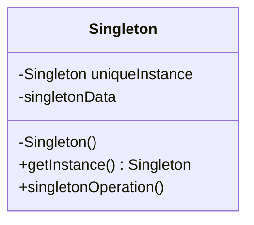

# Singleton
Il design pattern **singleton** assicura che una classe abbia una sola istanza e ne fornisce un punto di accesso globale.


La classe *Singleton* implementa un metodo statico `getInstance()` che crea l'istanza se questa non ancora esiste mentre la restituisce se l'istanza è già stata creata. Il costruttore del *Singleton* deve essere privato in modo che non possa essere richiamato da altre classi durante la creazione con la keyword `new`. 

La classe *Singleton* stessa ha pieno controllo di come e quando i client accedono all'unica istanza presente ed evita la presenza di variabili globali per la memorizzazione della istanza condivisa. Una variante del *Singleton* che permette un numero finito di istanziazioni della classe viene detta *Multiton*. Per rendere un *Singleton* un *Multiton* non bisogna modificare il codice che richiama la classe, basterà modificare la classe *Singleton*.

## Esempio
```java
public class Logs {           // Classe Singleton
	private static Logs obj;  // obj tiene l’istanza
	private List<String> l;   // tiene i dati da registrare

	private Logs() {          // il costruttore è privato
		empty();
	}
	
	public static Logs getInstance(){ // restituisce l’unica istanza
		if (obj == null) obj = new Logs(); // crea l’istanza se non presente
			return obj;
		}
		
	public void record(String s) {  // accoda il dato
		l.add(s);
	}
	
	public String dumpLast() { // restituisce l’ultimo dato
		return l.getLast();
	}
		
	public String dumpAll() { // restituisce tutti i dati
		String acc = "";
		for (String s : l) // s tiene ciascun elemento in lista, ad ogni passata
			acc = acc.concat(s);
		return acc;
	}
	
	public void empty() {
		l = new ArrayList<String>();
	}
}
```