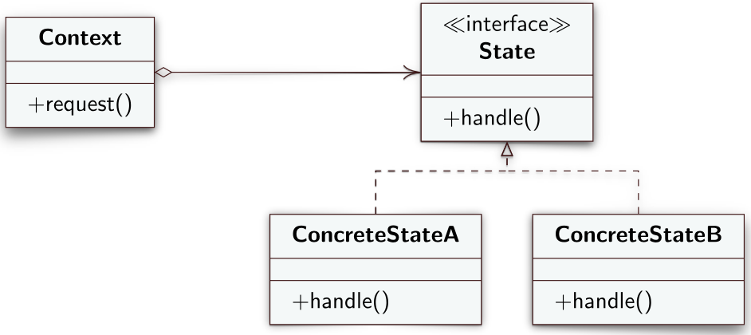
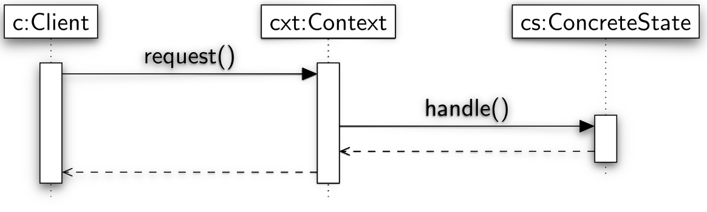

# State
Lo State è un design pattern comportamentale che permette ad un oggetto di alterare il proprio comportamento quando il suo stato interno cambia.
## Intento
L'intento del design pattern State è quello di far cambiare il comportamento di un oggetto quando il suo stato interno cambia in modo da far sembrare alle classi client che l'oggetto abbia cambiato classe.
## Problema
Supponiamo che una volta scritta una classe ci accorgiamo che il suo comportamento è definito da grossi rami condizionali (ripetuti fra diversi metodi) che si basano sullo stato di certe variabili interne alla classe che ne definiscono di fatto lo stato interno. Il suo comportamento, quindi, cambierà a run time in base ai valori di quelle variabili. La ripetizione dei rami condizionali rende il codice più complesso e difficile da leggere.
## Soluzione
Il design pattern State suggerisce una separazione dei vari stati in cui la classe si può trovare e quindi dei vari rami condizionali in classi diverse. Per fare ciò definisce i seguenti ruoli
- **Context**: classe che mette a disposizione i metodi definiti dalla classe *State* ai client. Mantiene al suo interno una variabile di tipo *State* che verrà istanziata con un *ConcreteState* in base allo stato corrente e implementa metodi che gestiscono la logica di cambiamento dello stato. 
- **State**: interfaccia che dichiara i vari metodi che i *ConcreteState* implementano. 
- **ConcreteState**: sottoclassi che implementano i diversi stati in cui la classe si può trovare. Si ha un *ConcreteState* per ogni stato. Se all'interno di un *ConcreteState* che rappresenta un certo stato non ha senso implementare un metodo definito nell'interfaccia *State* perché riservato per uno stato diverso, si può anche lasciare il metodo vuoto.

---
## Diagramma UML delle classi

---
## Collaborazioni
A run time, il client fa una certa richiesta al *Context* non conoscendo l'esistenza dei *ConcreteState*. Il *Context* gira la chiamata all'istanza del *ConcreteState* che definisce lo stato attuale. La logica che gestisce il cambio di stato può essere implementata all'interno del *Context* oppure direttamente all'interno di un *ConcreteState*.
## Diagramma UML di sequenza

---
## [Esempio](https://www.dmi.unict.it/tramonta/se/oop/appStatoBiglietti.html)
## Conseguenze
L'utilizzo del design pattern *State* fa sí che all'interno dei *ConcreteState* ci sia codice rilevante solamente per lo specifico stato che rappresentano. Questo permette di effettuare un partizionamento del codice il che facilita future modifiche o aggiunte di nuovi stati. Basterà aggiungere una nuova classe *ConcreteState* e modificare il *Context* in modo che venga a conoscenza del nuovo stato aggiunto. Il *Context*, inoltre, spesso implementa la logica di cambiamento di stati il che facilita la comprensione del codice e la sua separazione dal codice che gestisce i comportamenti all'interno degli stati.

Un'altra conseguenza del design pattern state è che il numero di classi aumenta ma il codice in ciascuna classe è molto più semplice da leggere e comprendere. 
